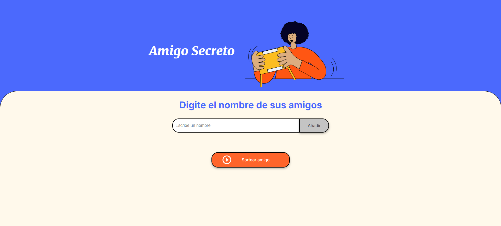

<!-- Un buen README incluye información sobre la instalación, dependencias, cómo ejecutar el proyecto, y posibles problemas o soluciones. -->
## Amigo Secreto
Challenge del programa **One Oracle Next Education** de la plataforma AluraLatam

Con el objetivo de practicar y consolidar los conocimientos de los cursos de lógica de programación con JavaScript.

### [Accede desde este enlace.](https://fersh5.github.io/challenge-amigo-secreto/)

### Funcionalidades:
* Agregar nombres: Los usuarios escribirán el nombre de un amigo en un campo de texto y lo agregarán a una lista visible al hacer clic en "Adicionar".

* Validar entrada: Si el campo de texto está vacío, o no cumple con los criterios de ser un nombre correcto, el programa mostrará una alerta pidiendo un nombre válido.

* Valida que no existan duplicados, en caso de intentar el mismo nombre se indicará a través de una alerta.

* Visualizar la lista: Los nombres ingresados aparecerán en una lista debajo del campo de entrada.

* Sorteo aleatorio: Al hacer clic en el botón "Sortear Amigo", se seleccionará aleatoriamente un nombre de la lista y se mostrará en la página.

